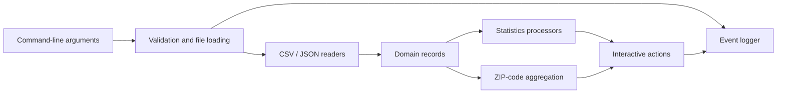

# Civic Data Explorer

**Java · CSV/JSON ingestion · layered architecture · data validation · memoization · JUnit**

A command-line analytics application that combines population, property, and vaccination records at ZIP-code level. It demonstrates how separate data sources become a navigable set of questions, with explicit input requirements and reusable calculation layers.

## Product context

Useful analytics require more than a calculation: a feature needs dependable inputs, a meaningful denominator, a clear interpretation, and predictable behavior when data is missing. This project makes those choices visible through a small, inspectable application.

For a Technical Product Manager, it provides concrete examples for discussing data contracts, feature dependencies, acceptance criteria, performance tradeoffs, and metric validity with engineering and data partners.

## Capabilities

- List the actions supported by the currently loaded datasets.
- Sum population across ZIP codes.
- Compute partial/full vaccination counts per capita for a selected date.
- Report average property market value and livable area for a ZIP code.
- Combine property and population data to compute market value per capita.
- Explore a legacy composite ratio across all three datasets, subject to the interpretation limits below.

This is an academic command-line application. It has no web service, SQL database, live data feed, or production deployment.

## Architecture



The source separates `datamanagement`, `processor`, `ui`, `logging`, and `util` responsibilities. The menu enables actions based on the readers available. Calculations cache selected results to avoid repeating work for identical requests.

The custom character-level CSV reader uses parsing states to distinguish delimiters, quoted fields, escaped quotes, and record boundaries. Property ingestion uses this reader. COVID CSV ingestion uses a separate line-based parser with narrower format support.

## Quick start

Prerequisites: a JDK on `PATH` and Python 3 for the standard-library launcher. The project was compiled and checked using JDK 24. Its existing IDE settings target Java 23. The repository includes `json-simple-1.1.1.jar`; no Java dependency manager is required for the demo.

From the repository root:

```bash
python scripts/run.py --population=examples/population.csv --properties=examples/properties.csv --covid=examples/covid.csv --log=demo.log
```

Choose `2` for a total population of `300`. Choose `4` and enter `19104` for average market value `150000`. Choose `3`, then `full`, then `2021-04-01` to inspect vaccination ratios. Enter `0` to exit.

**All bundled example records are synthetic.** They demonstrate application behavior and do not describe real conditions in those ZIP codes.

## Input contracts

- **Population CSV:** `zip_code`, `population`. ZIP codes use five digits; population supplies the denominator for per-capita calculations.
- **Property CSV:** `zip_code`, `market_value`, `total_livable_area`. ZIP prefixes are normalized to five digits; usable numeric values are selected for calculations.
- **COVID CSV or JSON:** `zip_code`, `etl_timestamp`, `partially_vaccinated`, `fully_vaccinated`. JSON expects an array of objects. Use timestamps such as `2021-04-01 00:00:00`.
- **Arguments:** `--population=...`, `--properties=...`, `--covid=...`, and optional `--log=...`. Duplicate and unknown argument names are rejected.

Vaccination per capita requires both population and vaccination inputs. Property per-capita calculations require property and population inputs. The composite ratio requires all three.

## Validation

The maintenance run passed **13 tests**: eight added regression cases and five existing vaccination-processor tests. All Java source files, including the legacy tests, compiled against JUnit Platform Console Standalone 1.11.4.

To rerun the portable selection with a locally downloaded JUnit console jar:

```bash
python scripts/run.py --test /path/to/junit-platform-console-standalone-1.11.4.jar
```

Regression coverage includes missing-data menu behavior, repeat invocation, end-of-input, missing headers, malformed counts, CSV trailing fields, quoted fields, and nonfinite property values. See [CHANGELOG.md](CHANGELOG.md) for the fixes.

Other original integration tests depend on unavailable datasets or machine-specific paths. They are preserved, but a full legacy-suite pass is not claimed.

## Tradeoffs and known limits

- **Metric semantics:** The feature named “health equity” in the original code divides a source count by integer-truncated market value per capita. Both supplied readers return fully vaccinated counts through the hospitalization-named method. The result is an exploratory ratio, not hospitalization data or a validated health-equity measure.
- **Snapshots:** Vaccination-rate processing selects the first record matching a date. Duplicate snapshots need a deliberate policy before broader use.
- **Validation consistency:** Readers differ in how malformed and missing values are handled. Zero defaults can blur the distinction between missing data and actual zero counts.
- **Scale:** Several readers load data into memory, and some ZIP lookups scan lists. No large-scale performance claim or benchmark is provided.
- **Caching:** Memoized results assume source data remains unchanged after loading; cache invalidation is not implemented.
- **Precision:** Several property outputs intentionally truncate to integers to retain the original output contract.
- **Format support:** The COVID CSV reader supports single-line quoted records, not the complete multiline CSV format.
- **Scope:** This maintenance pass fixes reproduced defects; it does not certify every input path or make the application production-ready.

## Collaboration and provenance

Original authors: **Edward Fu and Neira Ibrahimovic**. This was a collaborative academic project with assignment starter code. The original source history and team record remain intact. See [AUTHORS.md](AUTHORS.md).

Portfolio documentation, the launcher, synthetic examples, targeted maintenance fixes, and regression tests were prepared with AI assistance. No new license or redistribution permission is asserted for original materials.
